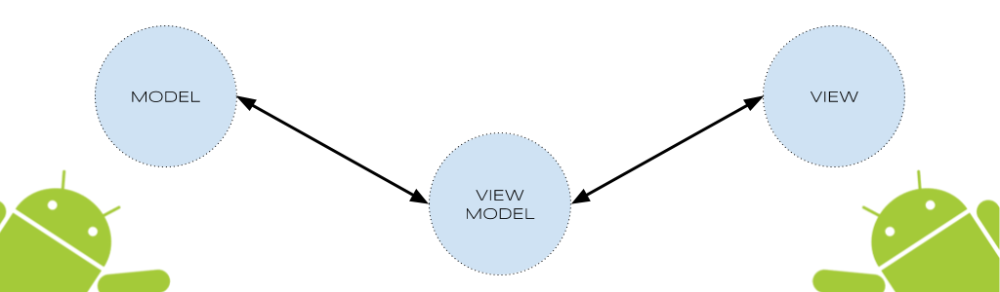
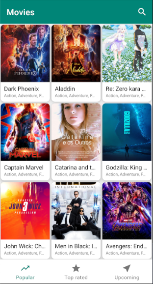
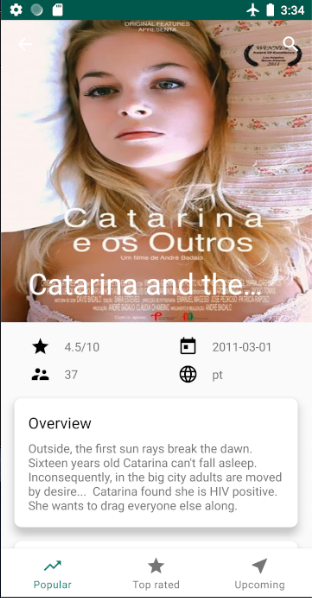
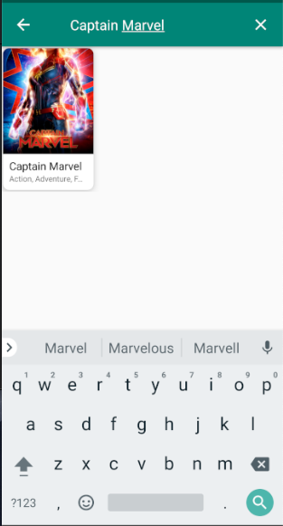

  

# Movie Api - MVVM + Coroutines + Kodein (DI)

Repository focus on consume API from [The Movie Database](https://www.themoviedb.org/) about movies available throughout the world. The application filter by three categories: Popular, Top Rated and Upcoming. 

In every list by category, the user is going to see the movie detail once they tapped down in a movie.

## Offline
The application works offline using latest technology feature offers by google as Architecture Components with Room, View Model and LiveData.

## Search
MovieRapApi has a funcionality of search every movie saved on local database no matter of every category type. 

## Threads
This project handle all their threads with Coroutines; depends on every task to accomplish it will switch between Dispatcher.Main to handle UI changes and Dispatcher.IO to perform database operations.

## App Layers
The project has three big layer which contain all classes filter by funcionality in directories. These are: <b>Data, Internal and UI.</b>

- <b>Data</b> layer handle all information need in the app. This folder contain inside it three big directories like <b>db, network and repository</b>.

- <b>Internal</b> directory contain classes that will handle functions or actions that help to our code to perform some action.

- <b>UI</b> layer will host all classes that have an interaction with the user.

## Data Layer
- <b>Db</b> directory contain converters that are classes which make factory pattern design to save the info in the database; Dao class that handle all query into local database; finally, entity folder that this are the model of how we are going to save the info in our local database. Moreover, this big folder contain MovieDatabase class that will create the database and define our models. 

- <b>Network</b> directory contain three folder like connectivity which will let is know if the device has internet connection; secondly, dataSource package that offers the method we can consume without how to do it, this works like a black box. Response folder contain the exactly object is fetched from the server. Moreover, ApiMovieService is the class that has all method that we are going to consume from Movie API.

- <b>Repository</b> directory is the one of the most important folder and classes due to this is the way we are going to fetch the info depends on some values; for example, if the info has been already downloaded, MovieRepository will fetch the info from local database. To acomplish this last step, DataSource class offers the info and send it back using Livedata by a new Thread.

## Internal Layer
- <b>Exceptions</b> directory contain classes that allows us to handle some no happy path like NO Internet Connection and how to handle these cases.

- <b>Extensions</b> directory is a new funcionality from kotlin language and let us to add more funcionality into classes that are already created. This case, I'm creating a lazyDeferred that let us to call new suspend functions.

- <b>Glide</b> directory contain a helper class to download images from server or local.

## UI Layer

- <b>Adapter</b> directory contain adapter that will be bind on our recycler view. In this case, I'm using a BaseViewHolder to handle two view types with the same data.

- <b>Base</b> directory contains abstract class that other class must be extends from it to make heritance of funcionalities.

- <b>Detail Movie</b> directory contain all the info like fragment and view model to show Movie detail.

- <b>Popular</b> directory contain a fragment specially dedicated to show movie popular.

- <b>Search</b> directory let us to find movie saved on our local database.

- <b>Top Rated</b> directory contain a fragment specially dedicated to show movie Top rated.

- <b>Upcoming</b> directory contain a fragment specially dedicated to show movie upcoming.

## Single Responsibility
This is one of the 5 principles of OOP (S: single Responsibility, O: Open Close Principle, L: Liskov Substitution, I: Interface Segregation, D: Dependency Inversion) and his main goals is that every class or method should only perform one action or task.

## Clean code 
The clean code are rules defined by Robert C. Martin AKA 'Uncle Bob' and let us a guide to how to write good code. For me, a good write code is that sort of code that is easy to read due to we expend a lot of time reading code no matter if we wrote it a few times before; so, it is important that every line of code could be express by itself what exactly it is doing.

Moreover, there are find some helper from 'uncle bob' that say some advice to accomplished when we desire to write good clean code like DRP (don't repeat yourself), The principle of least Astonishment, The boy scout rule, F.I.R.S.T. and S.O.L.I.D.

## Architecture
MVVM Architecture has been implemented on this project. My thought is that this design pattern is a better approach in comparison with MVP(Model View Presenter), MVC(Model View Controller) and MVI(Model View Intent) due to this has some advantages that other architecure doesn't.

## Advantages
The obvious purpose of MVVM pattern is abstraction of the View which reduces the amount of business logic in code-behind. However, following are some other solid advantages:

- The ViewModel is easier to unit test than code-behind or event-driven code.
- You can test it without awkward UI automation and interaction.
- The presentation layer and the logic is loosely coupled.

## Maintainability
- A clean separation of different kinds of code should make it easier to go into one or several of those more granular and focused parts and make changes without worrying. That means you can remain agile and keep moving out to new releases quickly.

## Testability
- With MVVM each piece of code is more granular and if it is implemented right your external and internal dependences are in separate pieces of code from the parts with the core logic that you would like to test. That makes it a lot easier to write unit tests against a core logic.

- Make sure it works right when written and keeps working even when things change in maintenance.

## Extensibility
- It sometimes overlaps with maintainability, because of the clean separation boundaries and more granular pieces of code.

- You have a better chance of making any of those parts more reusable.

- It has also the ability to replace or add new pieces of code that do similar things into the right places in the architecture.

## Disadvantages
- Some people think that for simple UIs, MVVM can be overkill.
- Similarly in bigger cases, it can be hard to design the ViewModel.
- Debugging would be bit difficult when we have complex data bindings.

## Running the app
The main folder contain an apk folder which inside of it you are going to see and APK file that could be install in any android device sdk version is major than 6.0 Mashmellow.

## Screenshots
  
 

## Dependencies

- Retrofit 2 [version: '2.4.0'](https://square.github.io/retrofit/): A type-safe HTTP client for Android and Java.

- OkHttp 3 [version: '3.4.1'](https://square.github.io/okhttp/): An HTTP & HTTP/2 client for Android and Java applications.

- AndroidX [version: '1.0.0'](https://mvnrepository.com/artifact/androidx): AndroidX is the open-source project that the Android team uses to develop, test, package, version and release libraries within Jetpack.

- Arch Lifecycle [version: '2.0.0'](https://developer.android.com/jetpack/androidx/releases/lifecycle): Lifecycle-aware components perform actions in response to a change in the lifecycle status of another component, such as activities and fragments. These components help you produce better-organized, and often lighter-weight code, that is easier to maintain. See the reference docs for more information.

- Mockito [version: '2.27.0'](https://site.mockito.org/): Mockito is a mocking framework that tastes really good. It lets you write beautiful tests with a clean & simple API.

- Kotlin Coroutines: [version:'1.0.0-RC1'](https://github.com/Kotlin/kotlinx.coroutines): Library support for Kotlin coroutines with multiplatform support. 

- Gson: [version:'2.8.5'](https://github.com/google/gson): Gson is a Java library that can be used to convert Java Objects into their JSON representation. It can also be used to convert a JSON string to an equivalent Java object.

- Material Design: [version:'1.0.0'](https://github.com/material-components): Material Components for Android is a drop-in replacement for Android's Design Support Library.

- KodeIn: [version:'5.2.0'](https://github.com/Kodein-Framework/Kodein-DI): Kodein is a very simple and yet very useful dependency retrieval container.

- Room: [version:'2.1.0-alpha01'](https://github.com/rom-rb/rom): The Room persistence library provides an abstraction layer over SQLite to allow for more robust database access while harnessing the full power of SQLite.

- Three Ten Abp: [version:'1.1.0'](https://github.com/JakeWharton/ThreeTenABP): This library places the timezone information as a standard Android asset and provides a custom loader for parsing it efficiently.

## Testing
[Pending]

## Animation
Navation Architecture components give us a simple way to implement transitions between views. It's important to define which animation we desired for every scenario.

## References

- ViewModel https://developer.android.com/topic/libraries/architecture/viewmodel
- LiveData https://developer.android.com/topic/libraries/architecture/livedata
- Android Architecture Blueprints https://github.com/googlesamples/android-architecture
- Android Jetpack: ViewModel https://www.youtube.com/watch?v=5qlIPTDE274
- Mockito : https://site.mockito.org/
- Unit Testing + Mockito + Kotlin + Architecture components https://medium.com/@marco_cattaneo/unit-testing-with-mockito-on-kotlin-android-project-with-architecture-components-2059eb637912
- Junit + LiveData https://jeroenmols.com/blog/2019/01/17/livedatajunit5/
- Eduardo Medina Github Account - MVVM project : https://github.com/emedinaa/kotlin-mvvm
- MVVM Resources: https://www.tutorialspoint.com/mvvm/mvvm_advantages.htm 

## License
[MIT](https://choosealicense.com/licenses/mit/)
